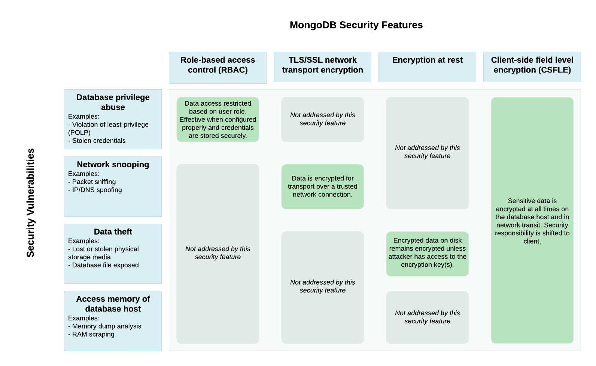

# 特征

## 概述

在此页面上，您可以了解客户端字段级加密 (CSFLE) 的安全优势，以及 CSFLE 与 MongoDB 支持的其他安全机制的比较。您还可以查看一个虚构场景，该场景展示了 CSFLE 在保护数据方面的价值。

客户端字段级加密 (CSFLE) 是 MongoDB 的一项功能，它使客户端应用程序能够在通过网络传输数据之前对其进行加密。敏感数据由客户端透明地加密和解密，并且仅以加密形式与服务器通信。CSFLE 在以下情况下保持加密字段的安全：

- 数据库超级用户直接访问加密字段
- 通过读取服务器的内存访问加密字段
- 通过不安全的网络捕获加密字段
- 通过读取数据库或备份文件访问磁盘上的加密字段

虽然所有客户端都可以访问非敏感数据字段，但只有经过适当配置的 CSFLE 客户端才能读取和写入加密数据字段。

> 重要的:
>
> **远程密钥管理系统**
>
> 当您在生产中使用 CSFLE 时，您必须使用远程密钥管理系统 (KMS) 来存储您的加密密钥。
>
> 要查看演示如何将远程 KMS 与 CSFLE 结合使用的分步指南，请参阅[教程。](https://www.mongodb.com/docs/manual/core/csfle/tutorials/#std-label-csfle-tutorial-automatic-encryption)
>
> 要查看所有受支持的 KMS 提供商的列表，请参阅 [CSFLE KMS 提供商。](https://www.mongodb.com/docs/manual/core/csfle/reference/kms-providers/#std-label-csfle-reference-kms-providers)
>
> 要详细了解为何应使用远程 KMS，请参阅 [使用远程 KMS 的原因。](https://www.mongodb.com/docs/manual/core/csfle/fundamentals/manage-keys/#std-label-csfle-reasons-to-use-remote-kms)

## 其他安全机制

本节描述了 MongoDB 支持的以下安全机制，并解释了它们的用例和限制:

- [基于角色的访问控制](https://www.mongodb.com/docs/manual/core/csfle/features/#std-label-csfle-features-role-based-access-control)
- [静态加密](https://www.mongodb.com/docs/manual/core/csfle/features/#std-label-csfle-features-encryption-at-rest)
- [传输加密 (TLS/SSL)](https://www.mongodb.com/docs/manual/core/csfle/features/#std-label-csfle-features-transport-encryption)

### 基于角色的访问控制

基于角色的访问控制是一种安全机制，允许管理员为用户授予和限制集合级别的权限。通过适当的角色定义和分配，此解决方案可防止意外泄露数据和访问权限。

基于角色的访问控制无法防止以下情况：

- 通过不安全的网络捕获数据
- 通过读取数据库或备份文件访问磁盘数据
- 通过读取服务器的内存来访问数据
- 数据库超级用户直接访问数据

要了解更多信息，请参阅 [基于角色的访问控制。](https://www.mongodb.com/docs/manual/core/authorization/)

### 静态加密

静态加密是一种加密磁盘上的数据库文件的机制。此机制可防止缺少数据库凭据但有权访问托管数据库的计算机的人查看您的数据。

此机制不会保护您的数据免受以下情况的影响：

- 通过不安全的网络捕获数据
- 通过读取服务器的内存来访问数据
- 数据库超级用户直接访问数据

要了解更多信息，请参阅 [静态加密。](https://www.mongodb.com/docs/manual/core/security-encryption-at-rest/)

### 传输加密 (TLS/SSL)

使用 TLS/SSL 的传输加密通过网络加密您的数据。TLS/SSL 在您的数据通过不安全的网络传输时保护您的数据，但不能保护您的数据免受特权用户的侵害或因为它位于磁盘上。

要了解更多信息，请参阅 [使用 TLS/SSL 的传输加密](https://www.mongodb.com/docs/manual/core/security-transport-encryption/)

## 功能比较

下图列出了 MongoDB 支持的安全特性以及它们解决的潜在安全漏洞：

> 重要的:
>
> **一起使用这些机制**
>
> 要保护生产部署，请同时使用本指南中讨论的所有安全机制。这些机制并不相互排斥。

## 设想

以下虚构场景演示了客户端字段级加密 (CSFLE) 在保护应用程序数据方面的价值，以及 CSFLE 如何与本指南中讨论的其他安全机制交互。

在这种情况下，我们保护医疗保健管理系统上的敏感数据，该系统存储患者的个人信息、保险信息和虚构公司*MedcoMD*的医疗记录。没有任何患者数据是公开的，并且他们的社会安全号码（SSN，美国政府颁发的 ID 号码）、保单号码和生命体征测量值等特定数据特别敏感并受隐私合规性约束。对公司和患者而言，保持数据的私密性和安全性非常重要。

MedcoMD 需要此系统来满足以下用例：

- 医生使用该系统访问患者的医疗记录、保险信息，并添加新的生命体征测量值。
- 接待员使用该系统使用患者的联系信息来验证患者的身份。
- 接待员可以查看患者的保单提供者，但不能查看他们的保单号码。
- 接待员无法访问患者的病历。

MedcoMD 还关注通过以下任何方法泄露敏感数据：

- 接待员公开屏幕上的数据意外泄露。
- 由超级用户（如数据库管理员）直接访问数据库。
- 通过不安全的网络捕获数据。
- 通过读取数据库服务器的内存来访问数据。
- 通过读取数据库或备份文件来访问数据。

MedcoMD 如何平衡其医疗管理系统的功能和访问限制？

### 解决方案

MedcoMD 使用以下安全机制来满足其用例并防止敏感医疗数据泄露：

- [传输加密 (TLS/SSL)](https://www.mongodb.com/docs/manual/core/csfle/features/#std-label-csfle-features-transport-encryption) 以保护数据在网络上传输时的安全。
- [静态加密](https://www.mongodb.com/docs/manual/core/csfle/features/#std-label-csfle-features-encryption-at-rest) 通过读取数据库或备份文件来防止数据泄露。
- [基于角色的访问控制](https://www.mongodb.com/docs/manual/core/csfle/features/#std-label-csfle-features-role-based-access-control) 限制数据库用户访问他们执行任务所需的集合。
- 使用 CSFLE 加密敏感字段以满足以下用例和约束：
  * 防止从服务器内存中读取数据，因为 CSFLE 加密数据永远不会以未加密的形式存在于数据库服务器上。
  * 通过向接待员提供未启用 CSFLE 的客户端，允许接待员验证患者的身份并防止在接待员的公开屏幕上意外泄露敏感数据。
  * 通过为医生提供支持 CSFLE 的客户端，允许医生在办公室私下查看敏感数据。

## 了解更多

要查看您应该实施以保护 MongoDB 部署的安全措施列表，请参阅 [安全清单。](https://www.mongodb.com/docs/manual/administration/security-checklist/)

要开始使用 CSFLE，请参阅[快速入门。](https://www.mongodb.com/docs/manual/core/csfle/quick-start/#std-label-csfle-quick-start)

译者：韩鹏帅

原文：[Features](https://www.mongodb.com/docs/manual/core/csfle/features/)